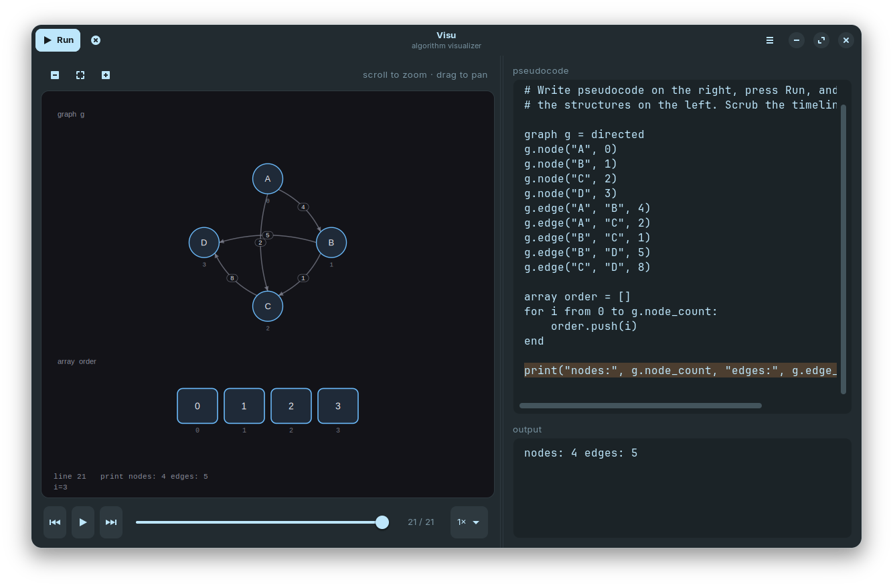
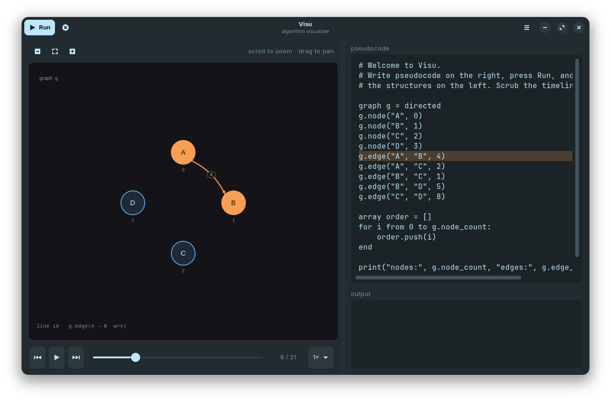
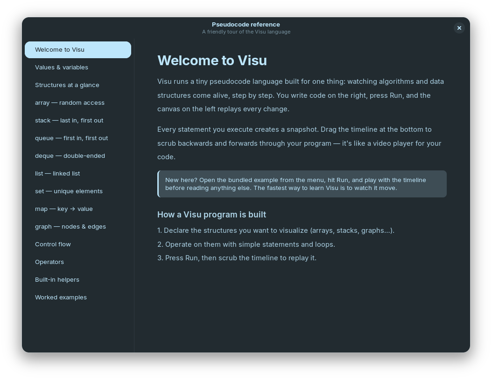

<p align="center">
  
</p>

<h1 align="center">Visu</h1>

<p align="center"><em>Visualize algorithms step by step.</em></p>

<p align="center">
  <a href="https://flathub.org/apps/io.github.iionel.Visu"></a>
  
  
  
</p>

<p align="center">
  
</p>

---

Write pseudocode in the editor, press **Run**, and the canvas replays every step on the structures you declared. A timeline at the bottom lets you scrub backwards and forwards through the execution — like a video player for your code.

Visu ships eight built-in structures (`array`, `stack`, `queue`, `deque`, `list`, `set`, `map`, and directed/undirected `graph`), each with a dedicated animated renderer. Built with Python, GTK 4, and libadwaita for modern GNOME desktops.

## Highlights

- **Purpose-built pseudocode language** — small, readable, no setup
- **Step-by-step timeline** — play, pause, step, scrub, and adjust speed
- **Live line highlighting** — see exactly which statement is running
- **Built-in reference** — every structure and helper documented with examples (`F1`)
- **Worked examples included** — bubble sort, DFS, union-find, and more

## Install

### Flatpak (recommended)

```bash
flatpak install flathub io.github.iionel.Visu
flatpak run io.github.iionel.Visu
```

### From source

Install the GTK 4 / libadwaita system libraries, then run directly:

```bash
# Debian / Ubuntu
sudo apt install python3-gi python3-gi-cairo gir1.2-gtk-4.0 gir1.2-adw-1

# Fedora
sudo dnf install python3-gobject gtk4 libadwaita python3-cairo

# Arch
sudo pacman -S python-gobject gtk4 libadwaita python-cairo
```

```bash
python3 -m visu
# or: pip install . && visu
```

### Build the Flatpak locally

```bash
flatpak install flathub org.gnome.Platform//50 org.gnome.Sdk//50
flatpak-builder --user --install --force-clean build-dir \
    flatpak/io.github.iionel.Visu.yml
flatpak run io.github.iionel.Visu
```

## Quick start

1. Launch the app. The editor loads a bundled example.
2. Edit the pseudocode on the right.
3. Press **Run** (`Ctrl+Return` or `F5`).
4. Watch the structures animate on the left. Scrub the timeline to step through.
5. Press `F1` to open the pseudocode reference.

## Keyboard shortcuts

| Action                 | Shortcut             |
| ---------------------- | -------------------- |
| Run program            | `Ctrl+Return`, `F5`  |
| Open file              | `Ctrl+O`             |
| Save / Save as         | `Ctrl+S` / `Ctrl+Shift+S` |
| Undo / Redo            | `Ctrl+Z` / `Ctrl+Y`  |
| Pseudocode reference   | `F1`                 |
| Zoom in / out (canvas) | `+` / `-` or scroll  |
| Reset zoom and pan     | `0`                  |
| Quit                   | `Ctrl+Q`             |

## The pseudocode language

The language is intentionally small. The full reference ships inside the app.

### Declaring structures

```text
array a = [5, 2, 9, 1]
stack s = []
queue q = []
deque d = []
list  l = [1, 2, 3]
set   u = [1, 2, 2, 3]
map   m = []
graph g = directed
```

### Operating on them

```text
a.push(4)
a[0] = 99
swap(a, 0, 1)
s.push(10)
q.enqueue("task")
d.push_front(0)
l.append(42)
u.add("seen")
m.set("alice", 30)
g.node("A")
g.edge("A", "B", 3.5)
```

### Control flow

```text
if a.length > 0:
    print("not empty")
else:
    print("empty")
end

for i from 0 to a.length:
    print(a[i])
end

while x < 10:
    x = x + 1
end
```

### Built-in helpers

```text
print(x, y, ...)
highlight(target, ...)
swap(arr, i, j)
```

A complete tour with worked examples (bubble sort, breadth-first search, word frequency counting) is available inside the app via `F1`.

## Screenshots

<p align="center">
  
  
</p>

## Project layout

```
visu/
    app.py              Application entry point and global actions
    docs.py             Pseudocode reference content
    interpreter/        Lexer, parser, runtime, snapshot recording
    render/             Canvas, animators, per-structure renderers
    ui/                 Window, panels, timeline, dialogs
data/                   Desktop file, AppStream metadata, icon, screenshots
flatpak/                Flathub manifest
tests/                  Test suite
```

## Development

```bash
python3 -m pytest
```

The interpreter pipeline lives under `visu/interpreter/` (lexer, parser, runtime, snapshots, structures). Each canvas renderer is a class under `visu/render/renderers/` that computes a natural layout and draws onto a Cairo context. The UI layer under `visu/ui/` wires everything together with GTK 4 widgets.

## Contributing

Bug reports and pull requests are welcome on the [issue tracker](https://github.com/iIonel/Visu/issues).

## License

Released under the [MIT License](LICENSE).
